<!-- $size: 16:9 -->
<link rel='stylesheet' href='slides.marp.css'>

# Natural Language Processing<br>with PyTorch

**Week 1** 딥러닝을 위한 PyTorch 실무환경 구축

---

## Quick preparation

1. Install **Anaconda**.
    * https://conda.io/ > Next > Installation > Regular installation > Choose your OS

2. Open Anaconda console, and create a new virtual environment.
    * `conda create -y --name pytorch-nlp python=3.6 numpy pyyaml scipy ipython mkl tqdm`

3. Install **PyTorch** on thenew environment (this may take a while).
    * `conda install --name pytorch-nlp pytorch-cpu torchvision -c pytorch`

---

## Ki Hyun Kim

<div style="float: right; width: 20rem;"></div>

* Machine Learning Researcher @ MakinaRocks
* Linkedin: https://www.linkedin.com/in/ki-hyun-kim/
* Github: https://github.com/kh-kim/
* Email: pointzz.ki@gmail.com

---

## Ki Hyun Kim

<div style="position: absolute; right: 0; bottom: 0; width: 25rem;"></div>

* Machine Learning Researcher @ SKPlanet
  * Neural Machine Translation
  * 글로벌 11번가
    * 한영/영한, 한중/중한 기계번역
    * 7000만 개 이상의 상품타이틀 번역, 리뷰 실시간 번역
  * SK AI asset 공유
    * SK C&C Aibril: 한중/중한, 한영/영한, 영중/중영 API 제공
    * SK 그룹 한영중 통번역기 API 제공

---

## Ki Hyun Kim

<div style="position: absolute; right: 5rem; bottom: -9rem; width: 22rem;"></div>

* Machine Learning Engineer @ TMON
  * Recommender System
  * QA-bot
* Researcher @ ETRI
  * Automatic Speech Translation
  * GenieTalk
* BS + MS of CS @ Stony Brook Univ.

---

## 오상준

<div style="position: absolute; width: 30rem; top: -1rem; right: -1rem;"></div>

- Deep Learning Engineer @ Deep Bio
  - 병리영상 기반 전립선암 진단모델 연구개발
  - GPU 서버 분산 스케쥴링 시스템 개발
* Co-founder, Research Engineer<br>@ QuantumSurf
  - 선물거래 알고리즘을 위한 API 설계 및 UX 개발
  - IPTV 영상품질 예측모델 연구개발
* BS in English Literature<br>@ 한국외국어대학교
---

## 오상준

* Github: https://github.com/juneoh
* Email: me@juneoh.net

---

### Course mechanics

* Course materials
  * By e-mail and GitHub
* Questions
  * Any time: during, before, or after lectures
  * In person, by e-mail or Facebook(TBD)
* FastCampus regulations
  * Maximum 2 absences allowed
  * 3 e-mail surveys: 1st, 3rd, 6th week

---

<!-- *template: section -->

## 1. Introduction to Deep Learning

---

### Genealogy

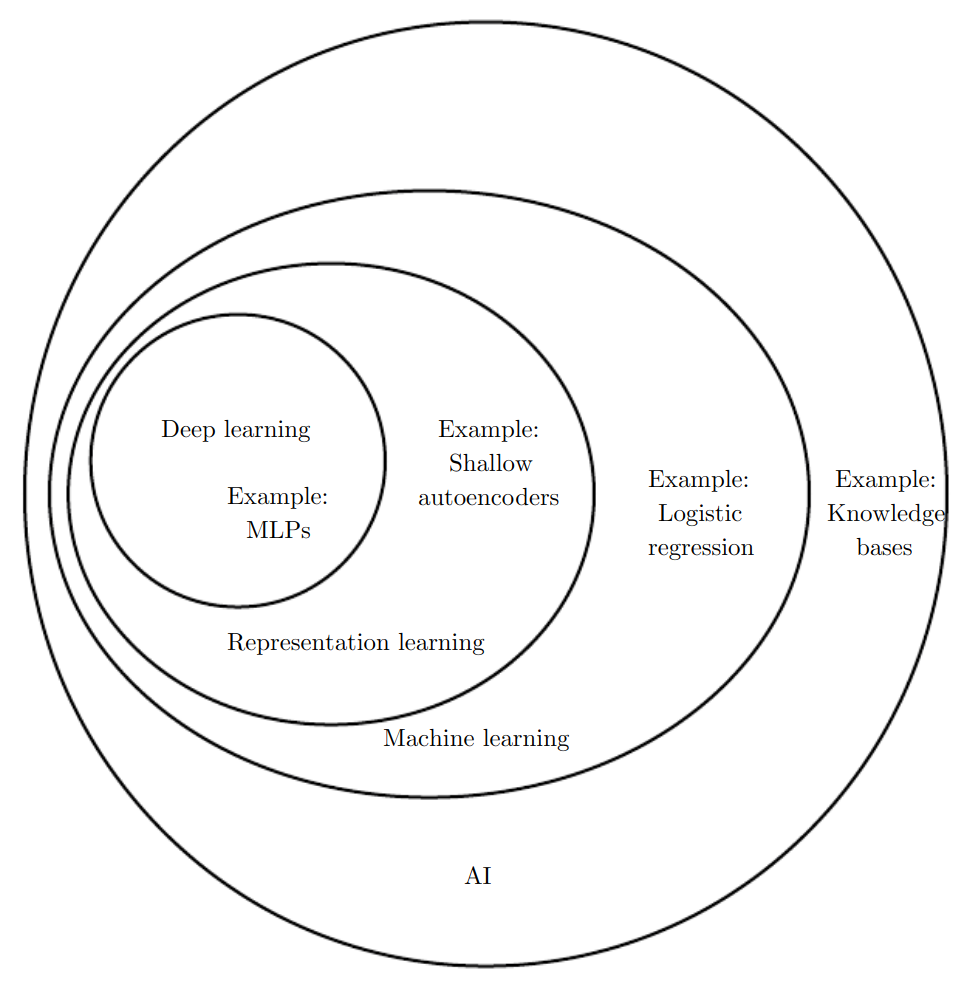

---

### Genealogy


---

### Timeline

* **Cybernetics** 1940s-1960s
  * McCulloch-Pitts neuron
    * McCulloch and Pitts, 1942.  A Logical Calculus of the Ideas Immanent in Nervous Activity.
  * Hebbian learning
    * Hebb, 1949.  The Organization of Behaviour.
  * Perceptron
    * Rosenblatt, 1958. The Perceptron: A Probabilistic Model for Information Storage and Organization in the Brain.

<!-- *footer: https://www.deeplearningbook.org/ -->

---

### Timeline

<!-- *footer: A McCulloch-Pitts neuron. -->

<br>


---

### Timeline

<!-- *footer: The XOR problem. -->

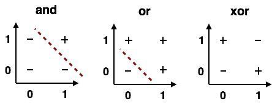

---

### Timeline

<br>

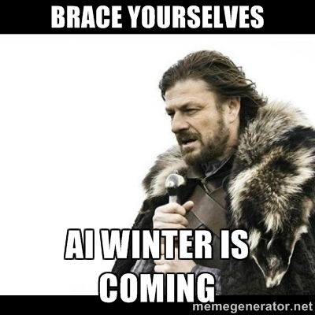

---

### Timeline

* **Connectionism** 1980s-1990s
  * Backpropagation
    * Rumelhart et al, 1986. Learning Representations by Back-propagating Errors.
  * Convolutional Neural Networks
    * Fukushima, 1980. Neocognitron: A Self-organizing Neural Network Model for a Mechanism of Pattern Recognition Unaffected by Shift in Position.

<!-- *footer: https://www.deeplearningbook.org/ -->

---

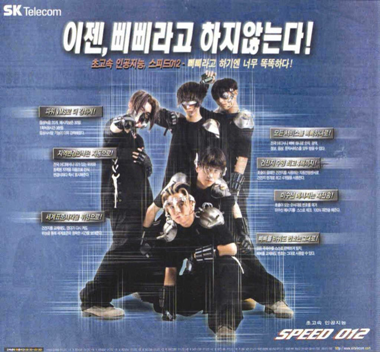

---

### Timeline

* **Deep Learning** 2006-
  * Deep Neural Networks
    * Hinton et al, 2006. A Fast Learning Algorithm for Deep Belief Nets.
  * Rectified Linear Units
    * Golorot et al, 2011. Deep Sparse Rectifier Neural Networks.
  * AlexNet
    * Krizhevsky et al, 2012. ImageNet Classifification with Deep Convolutional Neural Networks.

<!-- *footer: https://www.deeplearningbook.org/ -->

---

<!-- *footer: A biological neuron. -->

### Neural Networks

* Feed-forward Network


---

<!-- *footer: A perceptron. -->

### Neural Networks

* Feed-forward Network


---

### Neural Networks

* Feed-forward Network
  * In Python (with NumPy):
    ```python
    def perceptron(inputs, weights, biases):
        return sum(inputs * weights + biases)
    ```
  * In PyTorch:
    ```python
    outputs = module(inputs)
    ```

---

### Neural Networks

<!-- *footer: http://colah.github.io/posts/2014-03-NN-Manifolds-Topology/ -->

Problem: draw a single straight line to separate colors.


---

### Neural Networks

<!-- *footer: http://colah.github.io/posts/2014-03-NN-Manifolds-Topology/ -->

Problem: draw a single straight line to separate colors.


---

### Neural Networks

<!-- *footer: http://colah.github.io/posts/2014-03-NN-Manifolds-Topology/ -->

Problem: draw a single straight line to separate colors.


---

### Neural Networks

Problem: draw a single straight line to separate colors.

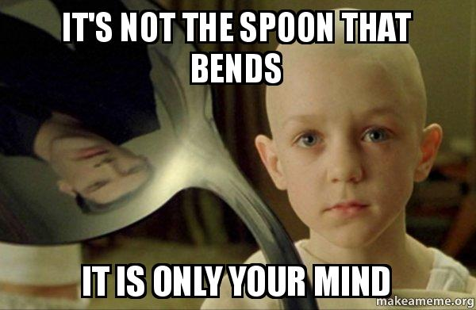

---

### Neural Networks

<!-- *footer: http://colah.github.io/posts/2014-03-NN-Manifolds-Topology/ -->

Problem: draw a single straight line to separate colors.


---

### Neural Networks

<!-- *footer: http://colah.github.io/posts/2014-03-NN-Manifolds-Topology/ -->


<center>The hidden layer learns a representation,<br>
so that the data is linearly separable.</center>

---

### Neural Networks

* Backpropagation

<center></center>

<!-- *footer: http://colah.github.io/posts/2015-08-Backprop/ -->

---

### Neural Networks

* Backpropagation
  * In Python (with NumPy):
    ```python
    def backpropagate(weights, derivative, learning_rate):
        return weights - learning_rate * (derivative - weights)
    ```
  * In PyTorch:
    ```python
    loss = loss_function(outputs, targets)
    loss.backward()
    ```
    
---

### Neural Networks

* Gradient Descent
  * Stochastic Gradient Descent, Momentum, Adagrad, Adam, ...


---

### Neural Networks

* Gradient Descent
  * Stochastic Gradient Descent, Momentum, Adagrad, Adam, ...


---

### Neural Networks

* Gradient Descent
  * Stochastic Gradient Descent, Momentum, Adagrad, Adam, ...
    * **SGD** is steady and stable. `torch.optim.SGD`
    * **Adam** is fast, but sometimes wacky. `torch.optim.Adam`
  * In PyTorch:  [`torch.optim`](https://pytorch.org/docs/stable/optim.html)
    ```python
    optimizer.zero_grad()
    loss.backward()
    optimizer.step()
    ```

---

<!-- *footer: A perceptron. -->

### Activation functions and non-linearity

<br>


---

### Activation functions and non-linearity

* Sigmoid


<!-- *footer: https://github.com/Kulbear/deep-learning-nano-foundation/wiki/ReLU-and-Softmax-Activation-Functions -->

---

### Activation functions and non-linearity

* Sigmoid
  $$\frac{1}{1 + e^x}$$
  * In Python (with NumPy):
    ```python
    def sigmoid(inputs):
        return 1.0 / (1.0 + exp(-inputs))
    ```

---

### Activation functions and non-linearity

* Sigmoid
  $$\frac{1}{1 + e^x}$$
  * In PyTorch: [`torch.nn.Sigmoid`](https://pytorch.org/docs/stable/nn.html#torch.nn.Sigmoid)
    * Provides automatic gradient calculation, guards against divide-by-zero
      errors, scales to batches, supports GPU, etc.

---

### Activation functions and non-linearity

* Rectified Linear Units (ReLU)


---

### Activation functions and non-linearity

* Rectified Linear Units (ReLU)
  $$max(0, x)$$
  * In Python (with NumPy): 
    ```python
    def relu(inputs):
        return max(0, inputs)
    ```
  * In PyTorch: [`torch.nn.ReLU`](https://pytorch.org/docs/stable/nn.html#torch.nn.ReLU)<br>

---

### Activation functions and non-linearity

* Softmax

<!-- *footer: http://cs231n.stanford.edu/slides/2018/cs231n_2018_lecture03.pdf -->

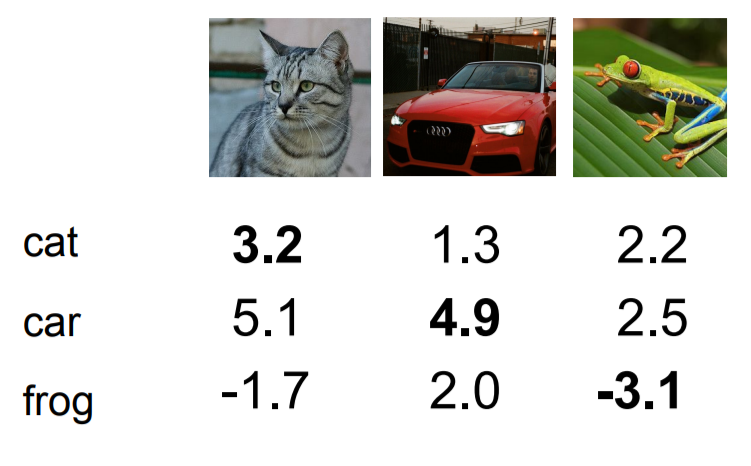

---

### Activation functions and non-linearity

* Softmax

<!-- *footer: https://github.com/Kulbear/deep-learning-nano-foundation/wiki/ReLU-and-Softmax-Activation-Functions -->


---

### Activation functions and non-linearity

* Softmax
  $$\frac{e^{z_{j}}}{\sum^K_{k=1}{e^{z_k}}}$$
  * In Python (with NumPy):
    ```python
    def softmax(inputs):
      return exp(inputs) / sum(exp(inputs))
    ```
  * In PyTorch: [`torch.nn.Softmax`](https://pytorch.org/docs/stable/nn.html#torch.nn.Softmax)

---

### Loss functions

* L1 loss and L2 loss
  * k-Nearest Neighbors

<!-- *footer: http://cs231n.stanford.edu/slides/2018/cs231n_2018_lecture02.pdf -->
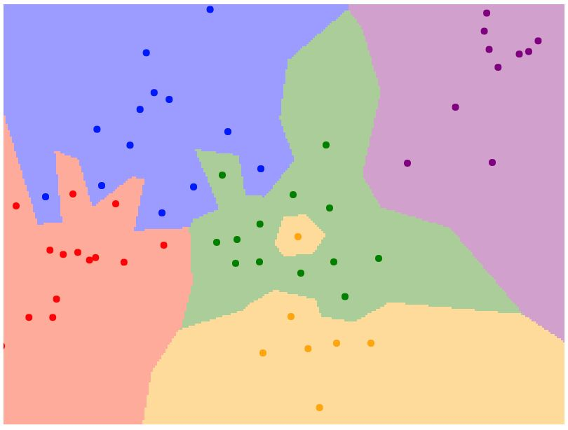

---

### Loss functions

* L1 loss and L2 loss

<!-- *footer: http://cs231n.stanford.edu/slides/2018/cs231n_2018_lecture02.pdf -->
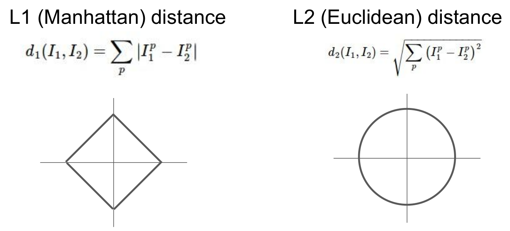

---

### Loss functions

* L1 loss
  $$\sum^n_{i=1}|y_i - \hat{y}_i|$$
  * In Python (with NumPy):
    ```python
    def l1_loss(targets, outputs):
        return sum(abs(targets - outputs))
    ```
  * In PyTorch: [`torch.nn.L1Loss`](https://pytorch.org/docs/stable/nn.html#torch.nn.L1Loss)<br>

---

### Loss functions

* L2 loss
    $$\sum^n_{i=1}(y_i - \hat{y}_i)^2$$
    * In Python (with NumPy):
      ```python
      def l2_loss(targets, outputs):
          return sum(sqrt((targets - outputs)**2))
      ```
    * In PyTorch: [`torch.nn.MSELoss`](https://pytorch.org/docs/stable/nn.html#torch.nn.MSELoss)<br>

---

### Loss functions

* Mean Square Error
  $$\frac{1}{n}\sum^n_{i=1}(y_i - \hat{y_i})^2$$
  * In Python (with NumPy):
    ```python
    def mean_square_error(targets, outputs):
        return mean(sqrt((targets - outputs)**2))
    ```
  * In PyTorch: [`torch.nn.MSELoss`](https://pytorch.org/docs/stable/nn.html#torch.nn.MSELoss)<br>

---

### Loss functions

* Cross Entropy
<center>
<br>
<strong>Entropy</strong>(in information theory)<br><br>
    = amount of information in an event<br><br>
    = amount of surprise
</center>

---

### Loss functions

* Cross Entropy
  * Entropy

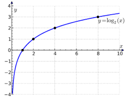

---

### Loss functions

* Cross Entropy
  * Entropy
    <br>
    $$ h[x] = -log(p(x)) $$

---

### Loss functions

* Cross Entropy

<!-- *footer: https://towardsdatascience.com/deep-learning-concepts-part-1-ea0b14b234c8 -->


---

### Loss functions

* Cross Entropy
  $$ -\sum^n_{i=1}y_iln(\hat{y_i}) $$
  * In Python:
    ```python
    def cross_entropy_loss(targets, outputs):
        return -sum(targets * log(outputs))
    ```
  * In PyTorch: [`torch.nn.CrossEntropyLoss`](https://pytorch.org/docs/stable/nn.html#torch.nn.CrossEntropyLoss)

---

### Loss functions

* Cross Entropy
  $$ -\frac{1}{n}\sum^n_{i=1}[y_iln(\hat{y_i}) + (1 -y_i)ln(1 - \hat{y_i})] $$
  * In Python:
    ```python
    def binary_cross_entropy_loss(targets, outputs):
        return -mean(targets * log(outputs) + (1 - targets) * log(1 - outputs))
    ```
  * In PyTorch: [`torch.nn.BCELoss`](https://pytorch.org/docs/stable/nn.html#torch.nn.BCELoss)

---

### Loss functions

* In most cases,
  * Use softmax and cross entropy loss in multi-class classifications
  * Use sigmoid and binary cross entropy loss in binary classifications

---

### Regularization methods

<!-- *footer: Bishop. Pattern Recognition and Machine Learning -->

<br>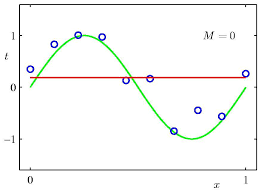

---

### Regularization methods

<!-- *footer: Bishop. Pattern Recognition and Machine Learning -->

<br>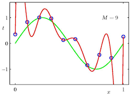

---

### Regularization methods

* Weight decay
  $$ W \leftarrow W - \lambda(\frac{\partial{L}}{\partial{W}} + \gamma\lVert W \rVert) $$
  * In Python (with NumPy):
    ```python
    def backpropagate(weights, derivative, learning_rate, weight_decay):
      weight_penalty = weight_decay * sum(sqrt(weights ** 2))
      return weights - learning_rate * (derivative @ weights + weight_penalty)
    ```
---

### Regularization methods

* Weight decay
  $$ W \leftarrow W - \lambda(\frac{\partial{L}}{\partial{W}} + \gamma\lVert W \rVert) $$
  * In PyTorch:
    ```python
    optimizer = torch.optim.SGD(learning_rate=0.1, weight_decay=0)
    ```

---

### Regularization methods

* Dropout

<!-- *footer: Hinton et al. Improving neural networks by preventing co-adaptation of feature detectors. 2012 -->


---


---

<!-- *template: section -->

## Hello PyTorch

---

<br>
<center></center>
<br>

* Deep Learning Framework
  * Tensorflow, Keras, Torch, Chainer, MXNet
* Python-native, NumPy-friendly
* Dynamic graphs
* https://pytorch.org/
* https://pytorch.org/docs/stable/index.html

---

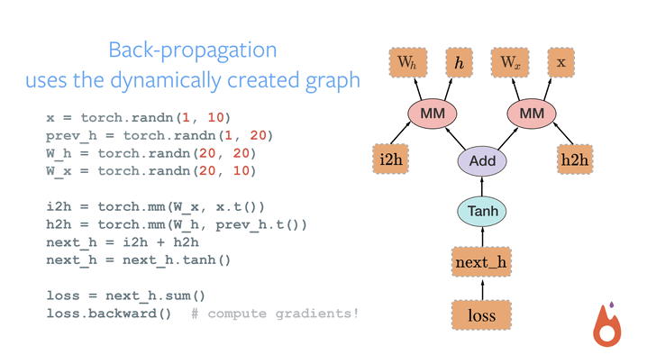

---

### Our stack

* **Python 3.6+**

```
The Zen of Python, by Tim Peters

Beautiful is better than ugly.
Explicit is better than implicit.
Simple is better than complex.
Complex is better than complicated.
Flat is better than nested.
Sparse is better than dense.
Readability counts.
```

---

### Our stack

* **Conda**
  * Package manager + virtual environments
  * https://conda.io/
<br>
<center></center>

---

### Our stack

* **Jupyter Notebook**
  * Document and visualize live code
  * http://jupyter.org/
<br>
<center></center>

---

### Quick preparation

1. Install **Anaconda**.
    * https://conda.io/ > Next > Installation > Regular installation > Choose your OS

2. Open Anaconda console, and create a new virtual environment.
    * `conda create -y --name pytorch-nlp python=3.6 numpy pyyaml scipy ipython mkl tqdm`

3. Install **PyTorch** on thenew environment (this may take a while).
    * `conda install --name pytorch-nlp pytorch-cpu torchvision -c pytorch`

---

### Installation guides

* [PyTorch, PyCharm, Windows 10](https://medium.com/@juneoh/pytorch-pycharm-windows-10-4598c25afe37)
* [AWS에 PyTorch 작업환경 꾸리기](https://medium.com/@juneoh/aws에-pytorch-작업환경-꾸리기-e77e77d5dd44)
* [Windows Subsystem for Linux에 PyTorch 설치하기](https://medium.com/@juneoh/windows-10-64bit-에서-pytorch-konlpy-mecab-설치하기-4af8b049a178)

---

<!-- *template: section -->

## Image Classification with PyTorch

---

### The data

* FashionMNIST


---

### The data

* FashionMNIST
  * Zalando's clothing product images
  * 28-pixel-square grayscale images
  * 60k examples for training, 10k samples for testing
  * 10 classes

---

### The model

* ResNet

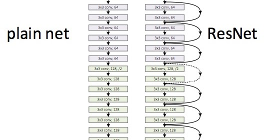

---

### The source

`git clone` or download https://github.com/juneoh/sample_pytorch_project

* `Dockerfile` if you want to use Docker.
* `README.md` the repository description.
* `main.py` the main code.
* `requirements.txt` the package requirements to run this example, for `pip`.

---

### The process

1. Prepare the data: training, validation, test.
2. Create the model and the loss function.
3. Create the optimizer and attach it to the model.
4. For each epoch, train, evaluate and save model.
5. Finally, evaluate the model on the test dataset.

---

### PyTorch modules

* [`torch.Tensor`](https://pytorch.org/docs/stable/tensors.html)
* [`torch.nn.Module`](https://pytorch.org/docs/stable/nn.html#module)
* [`torchvision.models.resnet`](https://github.com/pytorch/vision/blob/master/torchvision/models/resnet.py)

---

<!-- *template: center -->

### Into the code!

https://github.com/juneoh/sample_pytorch_project

---


---

### Additional tasks

* Try changing the optimizer to Adam and see how it works.
* Try using the [step learning rate scheduler](https://pytorch.org/docs/stable/optim.html#torch.optim.lr_scheduler.StepLR).
* Try training on the GPU.
<center></center>

---

<!-- *template: center -->

### Thank you!
