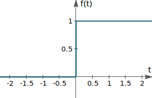
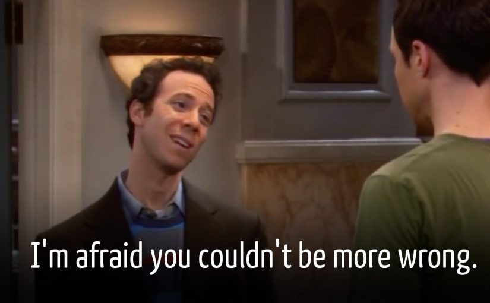
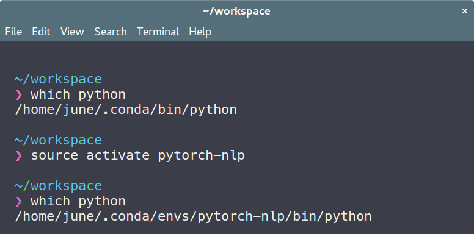
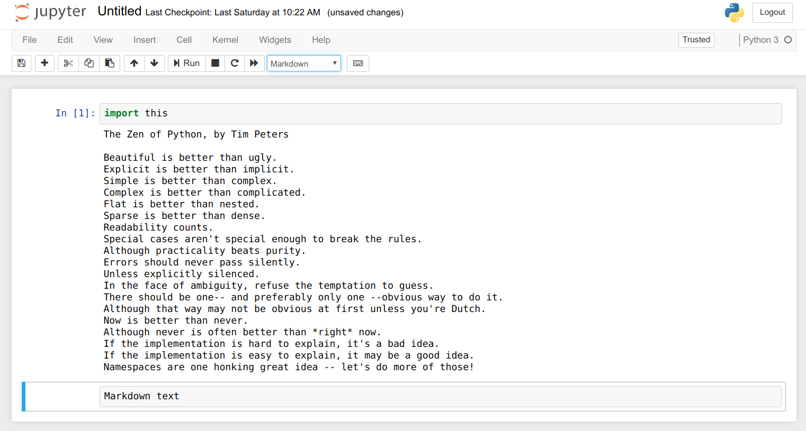
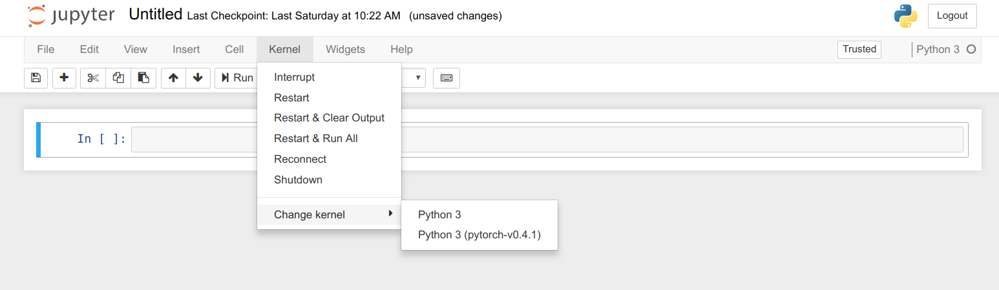
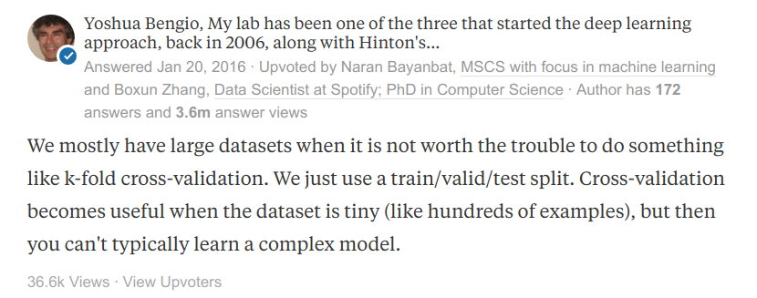

<!-- $size: 16:9 -->
<link rel='stylesheet' href='slides.marp.css'>

# Natural Language Processing<br>with PyTorch

**Week 1** 딥러닝을 위한 PyTorch 실무환경 구축

---

<!-- *template: center -->

## Course introduction

---

### Ki Hyun Kim


* Machine Learning Researcher @ MakinaRocks
* Linkedin: https://www.linkedin.com/in/ki-hyun-kim/
* Github: https://github.com/kh-kim/
* Email: pointzz.ki@gmail.com

---

### Ki Hyun Kim


* Machine Learning Researcher @ SKPlanet
  * Neural Machine Translation
  * 글로벌 11번가
    * 한영/영한, 한중/중한 기계번역
    * 7000만 개 이상의 상품타이틀 번역, 리뷰 실시간 번역
  * SK AI asset 공유
    * SK C&C Aibril: 한중/중한, 한영/영한, 영중/중영 API 제공
    * SK 그룹 한영중 통번역기 API 제공

---


### Ki Hyun Kim

* Machine Learning Engineer @ TMON
  * Recommender System
  * QA-bot
* Researcher @ ETRI
  * Automatic Speech Translation
  * GenieTalk
* BS + MS of CS @ Stony Brook Univ.

---

### 오상준


* Deep Learning Engineer @ Deep Bio
  - 병리영상 기반 전립선암 진단모델 연구개발
  - GPU 서버 분산 스케쥴링 시스템 개발
* Co-founder, Research Engineer<br>@ QuantumSurf
  - 선물거래 알고리즘을 위한 API 설계 및 UX 개발
  - IPTV 영상품질 예측모델 연구개발
* BS in English Literature @ 한국외국어대학교

---

### 오상준

* Github: https://github.com/juneoh
* Email: me@juneoh.net

---

### This lecture is for

To follow the hands-on sessions,

* people who know basic Python programming (data structures, OOP)
  * = [무작정 따라하는 파이썬 프로그래밍 (YouTube)](https://www.youtube.com/watch?v=ub9Dh9IwSrk)

* people who have heard of the basics of machine learning and/or deep learning
  * = [모두를 위한 딥러닝/머신러닝](https://www.youtube.com/playlist?list=PLlMkM4tgfjnLSOjrEJN31gZATbcj_MpUm) or  [PyTorch Zero to All](https://www.youtube.com/playlist?list=PLlMkM4tgfjnJ3I-dbhO9JTw7gNty6o_2m)

---

### This lecture is for

And preferrably, to fully catch the theory,

* people who understand the basic concepts of related mathematics (statistics, probability, calculus, and linear algebra)
  * = [Machine Learning by Andrew Ng (Coursera)](https://www.coursera.org/learn/machine-learning)

<br>

But even if not, **just ask!**

---

### What this course does NOT offer

* mere scrap information from all those deep learning YouTubes and blogs on the web
* basic programming and mathematics
  * [(왕초보) 프로그래밍 첫걸음 시작하기 (Fast campus)](https://www.fastcampus.co.kr/dev_online_introdev/)
  * [(초보) 파이썬으로 개발 시작하기 (Fast campus)](https://www.fastcampus.co.kr/dev_online_python/)
  * [(중고급) 파이썬 완전 정복 CAMP (Fast campus)](https://www.fastcampus.co.kr/dev_camp_allpython/)
  * [(초급) 딥러닝을 위한 최적화와 수치해석 CAMP (Fast campus)](https://www.fastcampus.co.kr/data_camp_scikit/)

---

### What this course does NOT offer

* *everything* deep learning can do
  * [(초급) PyTorch로 시작하는 딥러닝 입문 CAMP (Fast campus)](https://www.fastcampus.co.kr/data_camp_pytorch/)
* deeper topics of NLP: seq2seq, neural machine translation
  * [(고급) PyTorch를 활용한 자연어처리 심화 CAMP](https://www.fastcampus.co.kr/data_camp_nlpadv/) (본 강의와 상호 할인)

---

### What this course DOES offer

* a quick piece-together understanding of core concepts in deep NLP for intuition and insight
* hands-on sessions with working project codebase to freely exploit
* real-life tips and thorough support from field experts
* a comprehensive guide of how you should study further

---

### The goal
<center>
<br>
<b>A rapid, focused deep NLP bootcamp</b>:<br><br>
the journey from a beginner in deep learning to a junior NLP researcher, capable of setting up the environment and building business-level text classification models
</center>

---

### Syllabus

* 1회차: 딥러닝을 위한 PyTorch 실무환경 구축 - 오상준
  * [이론] Introduction to Deep Learning, Hello PyTorch
  * [실습] Image Classification with PyTorch
    <br>
* 2회차: CNN and RNN in PyTorch - 오상준
  * [이론] Deep Neural Networks
  * [실습] Cryptocurrency price prediction with PyTorch

---

### Syllabus

* 3회차: Neural Language Processing - 김기현
  * [이론] Natural Language Processing Introduction
    <br>
* 4회차: Word Sense Disambiguation - 김기현
  * [이론] Word Sense Disambiguation
  * [실습] Word Sense Disambiguation Excercise

---

### Syllabus

* 5회차: Word Embedding - 오상준
  * [이론] Word Vector Embedding
  * [실습] Word Embedding & Visualization
    <br>
* 6회차: Text Classification with PyTorch - 김기현
  * [이론] Text Classification
  * [실습] Text Classification using RNN and CNN

---

### Course mechanics

* Course materials
  * By e-mail and GitHub
* Questions
  * Any time: during, before, or after lectures
  * In person, by e-mail or Facebook(TBD)
* FastCampus regulations
  * Maximum 2 absences allowed
  * 3 e-mail surveys: 1st, 3rd, 6th week

---

### Complementary materials

#### Intermediate

The materials below cover the theoretical parts of this course. They are recommended for further commitment.

* [Deep Learning Book by Ian Goodfellow et al.](https://www.deeplearningbook.org/)
  * 딥러닝에 필요한 기초 선형대수 및 미적분부터 차근차근 설명합니다.
* [CS231n: Convolutional Neural Networks for Visual Recognition at Standford](https://www.youtube.com/playlist?list=PLC1qU-LWwrF64f4QKQT-Vg5Wr4qEE1Zxk) ([Materials](http://cs231n.stanford.edu/index.html))

---

### Complementary materials

#### Intermediate

* [CS224d: Deep Learning for Natural Language Processing at Standford](https://www.youtube.com/playlist?list=PL3FW7Lu3i5Jsnh1rnUwq_TcylNr7EkRe6) ([Materials](http://cs224d.stanford.edu/index.html))
  * Or, [Oxford Deep NLP 2017](https://github.com/oxford-cs-deepnlp-2017/lectures)
* [Google 머신러닝 단기집중과정](https://developers.google.com/machine-learning/crash-course/?hl=ko)
* [초보를 위한 도커 안내서 - 도커란 무엇인가?](https://subicura.com/2017/01/19/docker-guide-for-beginners-1.html)

---

### Complementary materials

#### Advanced

* [Pattern Recognition and Machine Learning 우리말 정리](http://norman3.github.io/prml/)

#### Other

* [라온피플 머신러닝 아카데미](https://laonple.blog.me/220463627091)
* [colah's blog](http://colah.github.io/)
  * 잘 찾아보시면 번역본도 몇 편 있습니다.

---

### Complementary materials

#### Tips and trends

* [The official PyTorch forums](https://discuss.pytorch.org/)
* [PyTorch KR (Facebook)](https://www.facebook.com/groups/PyTorchKR/)
* [TensorFLow KR (Facebook)](https://www.facebook.com/groups/TensorFlowKR/)
* [PR12 딥러닝 논문읽기 모임 (YouTube)](https://www.youtube.com/playlist?list=PLlMkM4tgfjnJhhd4wn5aj8fVTYJwIpWkS)
* [Two Minute Papers (YouTube)](https://www.youtube.com/channel/UCbfYPyITQ-7l4upoX8nvctg)
* [Machine Learning (Reddit)](https://www.reddit.com/r/MachineLearning/)
* [Google AI Blog](https://ai.googleblog.com)

---

<!-- *template: section -->

## 1. Introduction to Deep Learning

---


<!-- *footer: https://www.deeplearningbook.org/ -->

---

### Genealogy


---

### Timeline

* **Cybernetics** 1940s-1960s
  * McCulloch-Pitts neuron
    * McCulloch and Pitts, 1942.  A Logical Calculus of the Ideas Immanent in Nervous Activity.
  * Hebbian learning
    * Hebb, 1949.  The Organization of Behaviour.
  * Perceptron
    * Rosenblatt, 1958. The Perceptron: A Probabilistic Model for Information Storage and Organization in the Brain.

<!-- *footer: https://www.deeplearningbook.org/ -->

---

### Timeline

<!-- *footer: A McCulloch-Pitts neuron. -->

<br>


---

### Timeline


<!-- *footer: The XOR problem. -->

---

### Timeline


---

### Timeline

* **Connectionism** 1980s-1990s
  * Backpropagation
    * Rumelhart et al, 1986. Learning Representations by Back-propagating Errors.
  * Convolutional Neural Networks
    * Fukushima, 1980. Neocognitron: A Self-organizing Neural Network Model for a Mechanism of Pattern Recognition Unaffected by Shift in Position.

<!-- *footer: https://www.deeplearningbook.org/ -->

---


---

### Timeline

* **Deep Learning** 2006-
  * Deep Neural Networks
    * Hinton et al, 2006. A Fast Learning Algorithm for Deep Belief Nets.
  * Rectified Linear Units
    * Golorot et al, 2011. Deep Sparse Rectifier Neural Networks.
  * AlexNet
    * Krizhevsky et al, 2012. ImageNet Classifification with Deep Convolutional Neural Networks.

<!-- *footer: https://www.deeplearningbook.org/ -->

---

<!-- *footer: A biological neuron. -->

### Neural Networks

* Feed-forward Network


---

<!-- *footer: A perceptron. -->

### Neural Networks

* Feed-forward Network


---

### Neural Networks

* Feed-forward Network
  * In Python (with NumPy):
    ```python
    def perceptron(inputs, weights, biases):
        return sum(inputs * weights + biases)
    ```
  * In PyTorch:
    ```python
    outputs = module(inputs)
    ```

---

### Neural Networks

<!-- *footer: http://colah.github.io/posts/2014-03-NN-Manifolds-Topology/ -->

Problem: draw a single straight line to separate colors.


---

### Neural Networks

<!-- *footer: http://colah.github.io/posts/2014-03-NN-Manifolds-Topology/ -->

Problem: draw a single straight line to separate colors.


---

### Neural Networks

<!-- *footer: http://colah.github.io/posts/2014-03-NN-Manifolds-Topology/ -->

Problem: draw a single straight line to separate colors.


---

### Neural Networks

Problem: draw a single straight line to separate colors.


---

### Neural Networks

<!-- *footer: http://colah.github.io/posts/2014-03-NN-Manifolds-Topology/ -->

Problem: draw a single straight line to separate colors.


---

### Neural Networks

<!-- *footer: http://colah.github.io/posts/2014-03-NN-Manifolds-Topology/ -->


<center>The hidden layer learns a representation,<br>
so that the data is linearly separable.</center>

---

### Neural Networks

* Backpropagation


<!-- *footer: http://colah.github.io/posts/2015-08-Backprop/ -->

---

### Neural Networks

* Backpropagation
  * In Python (with NumPy):
    ```python
    def backpropagate(weights, derivative, learning_rate):
        return weights - learning_rate * (derivative - weights)
    ```
  * In PyTorch:
    ```python
    loss = loss_function(outputs, targets)
    loss.backward()
    ```
    
---

### Neural Networks

* Gradient Descent
  * Stochastic Gradient Descent, Momentum, Adagrad, Adam, ...


---

### Neural Networks

* Gradient Descent
  * Stochastic Gradient Descent, Momentum, Adagrad, Adam, ...


---

### Neural Networks

* Gradient Descent
  * Stochastic Gradient Descent, Momentum, Adagrad, Adam, ...
    * **SGD** is steady and stable. `torch.optim.SGD`
    * **Adam** is fast, but sometimes wacky. `torch.optim.Adam`
  * In PyTorch:  [`torch.optim`](https://pytorch.org/docs/stable/optim.html)
    ```python
    optimizer.zero_grad()
    loss.backward()
    optimizer.step()
    ```

---

<!-- *footer: A perceptron. -->

### Activation functions and non-linearity


---

### Activation functions and non-linearity

* Where activation functions are used
  * In-between layers: **ReLU** and its variants
  * After the final layer: **Sigmoid** or **Softmax**


<!-- *footer: http://colah.github.io/posts/2015-08-Backprop/ -->

---

### Activation functions and non-linearity

#### Step function



---



---

### Activation functions and non-linearity

#### Sigmoid function


<!-- *footer: https://github.com/Kulbear/deep-learning-nano-foundation/wiki/ReLU-and-Softmax-Activation-Functions -->

---

### Activation functions and non-linearity

#### Sigmoid function

$$\frac{1}{1 + e^{-x}}$$

* In Python (with NumPy):
    ```python
    def sigmoid(inputs):
        return 1.0 / (1.0 + exp(-inputs))
    ```
* In PyTorch: [`torch.nn.Sigmoid`](https://pytorch.org/docs/stable/nn.html#torch.nn.Sigmoid)
    * Provides automatic gradient calculation, guards against divide-by-zero
      errors, scales to batches, supports GPU, etc.

---

### Activation functions and non-linearity

#### Hyperbolic Tangent (tanh)


<!-- *footer: http://mathworld.wolfram.com/HyperbolicTangent.html -->

---

### Activation functions and non-linearity

#### Hyperbolic Tangent (tanh)

$$\frac{e^x - e^{-x}}{e^x + e^{-x}}$$

* In Python (with NumPy):
    ```python
    def tanh(inputs):
        return (exp(inputs) - exp(-inputs)) / (exp(inputs) + exp(-inputs))
    ```
* In PyTorch: [`torch.nn.Tanh`](https://pytorch.org/docs/stable/nn.html#torch.nn.Tanh)

---

### Activation functions and non-linearity

#### Rectified Linear Units (ReLU)


---

### Activation functions and non-linearity

#### Rectified Linear Units (ReLU)

$$max(0, x)$$
* In Python (with NumPy): 
    ```python
    def relu(inputs):
        return max(0, inputs)
    ```
* In PyTorch: [`torch.nn.ReLU`](https://pytorch.org/docs/stable/nn.html#torch.nn.ReLU)<br>

---

### Activation functions and non-linearity

#### Softmax function

<!-- *footer: http://cs231n.stanford.edu/slides/2018/cs231n_2018_lecture03.pdf -->


---

### Activation functions and non-linearity

#### Softmax function

<!-- *footer: https://github.com/Kulbear/deep-learning-nano-foundation/wiki/ReLU-and-Softmax-Activation-Functions -->


---

### Activation functions and non-linearity

#### Softmax function
  $$\frac{e^{z_{j}}}{\sum^K_{k=1}{e^{z_k}}}$$
  * In Python (with NumPy):
    ```python
    def softmax(inputs):
      return exp(inputs) / sum(exp(inputs))
    ```
  * In PyTorch: [`torch.nn.Softmax`](https://pytorch.org/docs/stable/nn.html#torch.nn.Softmax)

---

### Loss functions

#### L1 loss and L2 loss
  * k-Nearest Neighbors


<!-- *footer: http://cs231n.stanford.edu/slides/2018/cs231n_2018_lecture02.pdf -->

---

### Loss functions


<!-- *footer: http://cs231n.stanford.edu/slides/2018/cs231n_2018_lecture02.pdf -->

---

### Loss functions

#### L1 loss
  $$\sum^n_{i=1}|y_i - \hat{y}_i|$$
  * In Python (with NumPy):
    ```python
    def l1_loss(targets, outputs):
        return sum(abs(targets - outputs))
    ```
  * In PyTorch: [`torch.nn.L1Loss`](https://pytorch.org/docs/stable/nn.html#torch.nn.L1Loss)<br>

---

### Loss functions

#### L2 loss
    $$\sum^n_{i=1}(y_i - \hat{y}_i)^2$$
    * In Python (with NumPy):
      ```python
      def l2_loss(targets, outputs):
          return sum(sqrt((targets - outputs)**2))
      ```
    * In PyTorch: [`torch.nn.MSELoss`](https://pytorch.org/docs/stable/nn.html#torch.nn.MSELoss)<br>

---

### Loss functions

#### Mean Square Error
  $$\frac{1}{n}\sum^n_{i=1}(y_i - \hat{y_i})^2$$
  * In Python (with NumPy):
    ```python
    def mean_square_error(targets, outputs):
        return mean(sqrt((targets - outputs)**2))
    ```
  * In PyTorch: [`torch.nn.MSELoss`](https://pytorch.org/docs/stable/nn.html#torch.nn.MSELoss)<br>

---

### Loss functions

#### Cross Entropy
<center>
<br>
<strong>Entropy</strong>(in information theory)<br><br>
    = amount of information in an event<br><br>
    = amount of surprise
</center>

---

### Loss functions

#### Cross Entropy
  * Entropy


---

### Loss functions

#### Cross Entropy
  * Entropy
    <br>
    $$ h[x] = -log(p(x)) $$

---

### Loss functions

#### Cross Entropy

<!-- *footer: https://towardsdatascience.com/deep-learning-concepts-part-1-ea0b14b234c8 -->


---

### Loss functions

#### Cross Entropy
  $$ -\sum^n_{i=1}y_iln(\hat{y_i}) $$
  * In Python:
    ```python
    def cross_entropy_loss(targets, outputs):
        return -sum(targets * log(outputs))
    ```
  * In PyTorch: [`torch.nn.CrossEntropyLoss`](https://pytorch.org/docs/stable/nn.html#torch.nn.CrossEntropyLoss)

---

### Loss functions

#### Cross Entropy
  $$ -\frac{1}{n}\sum^n_{i=1}[y_iln(\hat{y_i}) + (1 -y_i)ln(1 - \hat{y_i})] $$
  * In Python:
    ```python
    def binary_cross_entropy_loss(targets, outputs):
        return -mean(targets * log(outputs) + (1 - targets) * log(1 - outputs))
    ```
  * In PyTorch: [`torch.nn.BCELoss`](https://pytorch.org/docs/stable/nn.html#torch.nn.BCELoss)

---

### Loss functions

* Baselines
  * Use softmax and cross entropy loss in multi-class classifications
  * Use sigmoid and binary cross entropy loss in binary classifications

---

### Regularization methods

<br>

<!-- *footer: Bishop. Pattern Recognition and Machine Learning -->

---

### Regularization methods

<br>

<!-- *footer: Bishop. Pattern Recognition and Machine Learning -->

---

### Regularization methods

#### Weight decay
  $$ W \leftarrow W - \lambda(\frac{\partial{L}}{\partial{W}} + \gamma\lVert W \rVert) $$
  * In Python (with NumPy):
    ```python
    def backpropagate(weights, derivative, learning_rate, weight_decay):
      weight_penalty = weight_decay * sum(sqrt(weights ** 2))
      return weights - learning_rate * (derivative @ weights + weight_penalty)
    ```
---

### Regularization methods

#### Weight decay
  $$ W \leftarrow W - \lambda(\frac{\partial{L}}{\partial{W}} + \gamma\lVert W \rVert) $$
  * In PyTorch:
    ```python
    optimizer = torch.optim.SGD(learning_rate=0.1, weight_decay=0)
    ```

---

### Regularization methods

#### Dropout


<!-- *footer: Hinton et al. Improving neural networks by preventing co-adaptation of feature detectors. 2012 -->

---

### FAQ

* Typical DL project workflow
  * Obtain and cleanse data
  * Overfit using latest baseline models
  * Tune and optimize
    * Hard example mining, model pruning, custom loss functions, etc.
  * Deploy
    * [Open Neural Network Exchange Format](https://onnx.ai/)

---


---

<!-- *template: section -->

## Hello PyTorch

---

<br>
<center></center>
<br>

* Deep Learning Framework
  * Tensorflow, Keras, Torch, Chainer, MXNet
* Python-native, NumPy-friendly
* Dynamic graphs
* https://pytorch.org/
* https://pytorch.org/docs/stable/index.html

---


---

### PyTorch core modules

#### [`torch.Tensor`](https://pytorch.org/docs/stable/tensors.html)

* $\approx$ `numpy.array`
* Creation

```python
>>> torch.Tensor([[1, 1, 1], [1, 1, 1]])

 1  1  1
 1  1  1
[torch.FloatTensor of size 2x3]
```

---

### PyTorch core modules

#### [`torch.Tensor`](https://pytorch.org/docs/stable/tensors.html)

* Broadcasting

```python
>>> torch.Tensor([[1, 1, 1], [1, 1, 1]]) * 2

 2  2  2
 2  2  2
[torch.FloatTensor of size 2x3]
```

---

### PyTorch core modules

#### [`torch.Tensor`](https://pytorch.org/docs/stable/tensors.html)

* In-place operations (marked by an underscore `_`)

```python
>>> a = torch.Tensor([[1, 1, 1], [1, 1, 1]])
>>> a.add_(2)
>>> a

 3  3  3
 3  3  3
[torch.FloatTensor of size 2x3]
```

---

### PyTorch core modules

#### [`torch.nn.Module`](https://pytorch.org/docs/stable/nn.html#module)

* The building block of PyTorch deep neural network models
* The Python magic method `__call__()` executes `forward()` method
* If `backward()` method is not defined, the backward is automatically created by `forward()`
* Allows nesting and chaining

---

### PyTorch core modules

#### [`torchvision.models.resnet`](https://github.com/pytorch/vision/blob/master/torchvision/models/resnet.py)

* The PyTorch reference implementation of the [ResNet](http://www.arxiv.org/abs/1512.03385)
* A great example of building PyTorch models with Python OOP

---

### Our stack

#### Python 3.6+

```text
The Zen of Python, by Tim Peters

Beautiful is better than ugly.
Explicit is better than implicit.
Simple is better than complex.
Complex is better than complicated.
Flat is better than nested.
Sparse is better than dense.
Readability counts.
```

---

### Our stack

#### Conda

* Package manager + virtual environments
* Accessed via the terminal (Ubuntu and macOS) or Anaconda Prompt (Windows)
* Distributions: Anaconda and Miniconda
* https://conda.io/
<br>
<center></center>

---

### Our stack

#### Conda

* Creating a new virtual environment
  ```bash
  $ conda create -n ENV
  ```

* Activating a virtual environment
  ```bash
  $ source activate ENV
  ```
  Remove `source` on Windows.
  
---

### Our stack

#### Conda

* Deactivating a virual environment
  ```bash
  $ deactivate
  ```
  
---

### Our stack

#### Conda

* Conda works by altering the `PATH` environment variable



---

### Our stack

#### Jupyter Notebook

* Document and visualize live code
* http://jupyter.org/
<br>
<center></center>

---



---

### Our stack

#### Jupyter Notebook

* Kernels



---

### Our stack

#### Jupyter Notebook

* Kernels
   * $\approx$ Conda environments
   * Adding a new kernel
       ```bash
       $ source activate pytorch-nlp # Remove "source" in Windows
       $ pip install ipykernel
       $ python -m ipykernel -n pytorch-nlp --display-name "Python 3.6 (pytorch-nlp)"
       ```

---

### Our stack

#### Docker CE

  * Container-based virtualization
  * https://www.docker.com/
    * [Install on Ubuntu](https://docs.docker.com/install/linux/docker-ce/ubuntu/)
    * [Install on macOS](https://docs.docker.com/docker-for-windows/install/)
    * [Install on Windows 10](https://docs.docker.com/docker-for-windows/install/)

<center></center>

---

### Our stack

#### Docker CE


---

### Our stack

#### Docker CE


---

### Our stack

#### Docker CE

* Commands (requires `sudo` privileges)
  * Create & start a new container
    ```bash
    $ docker run [OPTIONS] IMAGE
    ```
  * Stop a running container
    ```bash
    $ docker stop CONTAINER
    ```

---

### Our stack

#### Docker CE

* Commands (requires `sudo` privileges)
  * Start a stopped container
    ```bash
    $ docker start CONTAINER
    ```
  * Delete a container
    ```bash
    $ docker rm CONTAINER
    ```

---

### Our stack

#### Docker CE

* Commands (requires `sudo` privileges)
  * Copy files into the container
    ```bash
    $ docker cp FILE CONTAINER:PATH
    ```

---

### Installation guides

* [PyTorch, PyCharm, Windows 10](https://medium.com/@juneoh/pytorch-pycharm-windows-10-4598c25afe37)
* [AWS에 PyTorch 작업환경 꾸리기](https://medium.com/@juneoh/aws에-pytorch-작업환경-꾸리기-e77e77d5dd44)
* [Windows Subsystem for Linux에 PyTorch 설치하기](https://medium.com/@juneoh/windows-10-64bit-에서-pytorch-konlpy-mecab-설치하기-4af8b049a178)

---

<!-- *template: section -->

## Image Classification with PyTorch

---

### Preparation

1. Install **Anaconda**.
    * https://conda.io/ > Next > Installation > Regular installation > Choose your OS
2. In terminal(Ubuntu and macOS) or Anaconda Prompt(Windows), upgrade Conda and create a new virtual environment named `pytorch-nlp`.
    ```bash
    $ conda install conda
    $ conda create -y --name pytorch-nlp python=3.6 numpy pyyaml scipy ipython mkl tqdm
    ```

---

### Preparation

3. Install **PyTorch** on the new environment (this may take a while).
    * Ubuntu (terminal)
      ```
      $ conda install -n pytorch-nlp pytorch-cpu torchvision-cpu -c pytorch
      ```
      
    * macOS (terminal)
      ```bash
      $ conda install -n pytorch-nlp pytorch torchvision -c pytorch
      ```
      
    * Windows (Anaconda Prompt)
      ```bash
      $ conda install -n pytorch-nlp pytorch-cpu -c pytorch
      $ activate pytorch-nlp
      $ pip install torchvision
      ```

---

### Preparation

4. Create a new kernel for **Jupyter Notebook**.
    * Ubuntu and macOS (terminal)
      ```bash
      $ source activate pytorch-nlp
      $ pip install ipykernel
      $ python -m ipykernel install -n pytorch-nlp --display-name "Python 3 (pytorch-nlp)"
      ```
    * Windows (Anaconda Prompt)
      ```bash
      $ activate pytorch-nlp
      $ pip install ipykernel
      $ python -m ipykernel install -n pytorch-nlp --display-name "Python 3 (pytorch-nlp)"
      ```

---

### The data


#### FashionMNIST
  * Zalando's clothing product images
  * 28-pixel-square grayscale images
  * 60k examples for training, 10k samples for testing
  * 10 classes

---

### The model

#### ResNet


---

### The source

`git clone` or download https://github.com/juneoh/sample_pytorch_project

* `Dockerfile` if you want to use Docker.
* `README.md` the repository description.
* `main.py` the main code.
* `requirements.txt` the package requirements to run this example, for `pip`.

---

### The process

1. Prepare the data: training, validation, test.
2. Create the model and the loss function.
3. Create the optimizer and attach it to the model.
4. For each epoch, train, evaluate and save model.
5. Finally, evaluate the model on the test dataset.

---

### The process

:thinking: Why not use cross-validation?

 

<!-- *footer: https://www.quora.com/Is-cross-validation-heavily-used-in-deep-learning-or-is-it-too-expensive-to-be-used -->

---

<!-- *template: center -->

### Into the code!

https://github.com/juneoh/sample_pytorch_project

---

<!-- *template: center -->


---

<!-- *template: center -->

### Thank you!
