<!-- $size: 16:9 -->
<link rel='stylesheet' href='slides.marp.css'>

# Natural Language Processing<br>with PyTorch

**Week 2** Deep Neural Networks in PyTorch

<!-- *footer: https://github.com/juneoh/fastcampus-pytorch-nlp -->

---

<!-- *template: center -->

## Review & Warranty

---

## Contents

1. Convolutional Neural Networks
   * The convolutional layer
   * Batch normalization
   * Residual connections
   * Variations: dilated convolution, deconvolution, separable convolution

---

## Contents

2. Recurrent Neural Networks
   * The recurrent layer
   * Gradient vanishing and exploding
   * Gradient clipping
   * Variations: Long Short-Term Memory (LSTM), Gated Recurrent Unit (GRU)

---

## Contents

3. Cryptocurrency price prediction using CNN and RNN
   * Cryptocurrency 101
   * Obtaining and preprocessing the data
   * Building our first CNN model
   * Building our first RNN model
   * Train and test

---

<!-- *template: section -->

## Convolutional Neural Networks

* The convolutional layer
* Batch normalization
* Residual connections
* Variations: dilated convolution, deconvolution, separable convolution

---

### The convolutional layer


---

### The convolutional layer


<!-- *footer: https://github.com/GunhoChoi/PyTorch-FastCampus/blob/master/03_CNN_Basics/CNN_basic.pdf -->

---

### The convolutional layer


<!-- *footer: https://brohrer.github.io/how_convolutional_neural_networks_work.html -->

---

### The convolutional layer


<!-- *footer: https://brohrer.github.io/how_convolutional_neural_networks_work.html -->

---

### The convolutional layer


<!-- *footer: https://brohrer.github.io/how_convolutional_neural_networks_work.html -->

---

### The convolutional layer


<!-- *footer: https://brohrer.github.io/how_convolutional_neural_networks_work.html -->

---

### The convolutional layer


<!-- *footer: https://brohrer.github.io/how_convolutional_neural_networks_work.html -->

---

### The convolutional layer

<br>

 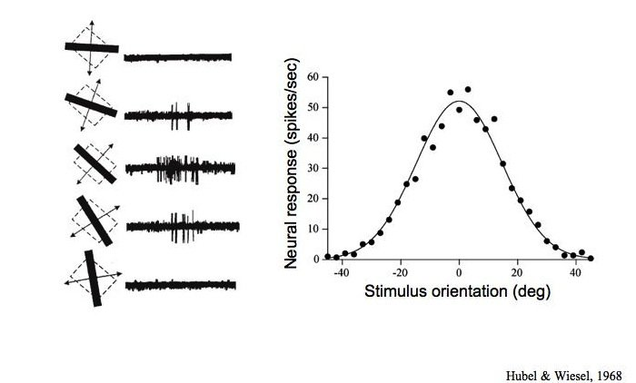

<!-- *footer: Receptive Fields, Binocular Interaction and Functional Architecture in the Cat's Visual Cortex -->

---

### The convolutional layer

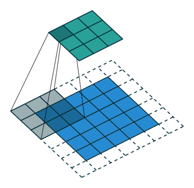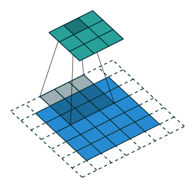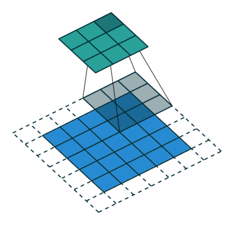

```python
torch.nn.Conv2d(in_channels=1, out_channels=1, kernel=(3, 3), stride=2, padding=1, dilation=1, bias=False)
```

<!-- *footer: https://github.com/vdumoulin/conv_arithmetic -->

---

### The convolutional layer

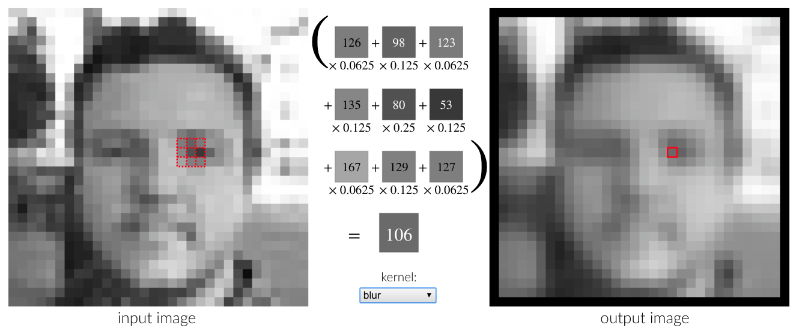

<!-- *footer: http://setosa.io/ev/image-kernels/ -->

---

### The convolutional layer


<!-- *footer: http://colah.github.io/posts/2015-08-Backprop/ -->

---


<!-- *footer: http://cs231n.github.io/convolutional-networks/ -->

---

### Batch normalization

> Training Deep Neural Networks is complicated by the fact that **the distribution of each layer's inputs changes during training**:cold_sweat:, as the parameters of the previous layers change. This slows down the training by requiring lower learning rates and careful parameter initialization, and makes it notoriously hard to train models with saturating nonlinearities. We refer to this phenomenon as internal covariate shift, and address the problem by **normalizing layer inputs**:relieved:. 

<!-- *footer: Batch Normalization: Accelerating Deep Network Training by Reducing Internal Covariate Shift (2015) -->

---

### Batch normalization


<!-- *footer: https://shuuki4.wordpress.com/2016/01/13/batch-normalization-%EC%84%A4%EB%AA%85-%EB%B0%8F-%EA%B5%AC%ED%98%84/ -->

---


<!-- *footer: Batch Normalization: Accelerating Deep Network Training by Reducing Internal Covariate Shift (2015) -->

---

### Batch normalization

In PyTorch: [`torch.nn.BatchNorm2d`](https://pytorch.org/docs/stable/nn.html#torch.nn.BatchNorm2d)

```python
class ConvWithBN(torch.nn.Module):
    def __init__(self, in_channels, out_channels):
        super(self, ConvWithBN).__init__()
        
        self.conv = torch.nn.Conv2d(in_channels, out_channels)
        self.bn = torch.nn.BatchNorm2d(out_channels)
    
    def forward(self, input):
        output = self.conv(input)
        output = self.bn(output)
        
        return output
```

---

### Residual connections

#### ResNet


<!-- *footer: Deep Residual Learning for Image Recognition -->

---

```python
class ResidualConnection(torch.nn.Module):
    def __init__(self, channels):
        supert(self, ResidualConnection).__init__()
        
        self.conv1 = torch.nn.Conv2d(in_channels=channels,
                                     out_channels=channels)
        self.relu1 = torch.nn.ReLU()
        self.conv2 = torch.nn.Conv2d(in_channels=channels,
                                     out_channels=channels)
        self.relu2 = torch.nn.ReLU()
    
    def forward(self, input):
        output = self.conv1(input)
        output = self.relu1(output)
        output = self.conv2(output)
        output = self.relu2(output + input)
        
        return output
```

---

### Residual connections

#### DenseNet

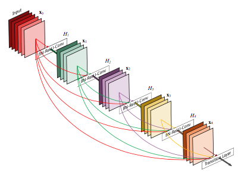

<!-- *footer: Densely Connected Convolutional Networks -->

---

### Residual connections

#### CondenseNet

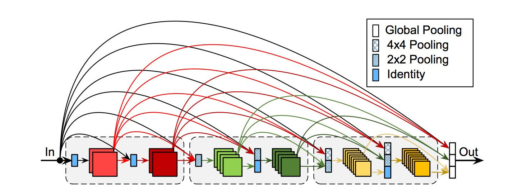

<!-- *footer: CondenseNet: An Efficient DenseNet using Learned Group Convolutions -->

---

### Variations

* **Deconvolution**
    * Reverse of regular convolution: make small inputs larger
    * a.k.a. transposed convolution, fractionally strided convolution, upconvolution
* **Dilated convolution**
    * Same size, more context
    * a.k.a. atrous convolution
* **Separable convolution**
    * Less parameters, more effective learning
    * = depthwise convolution + pointwise convolution

---

#### Deconvolution

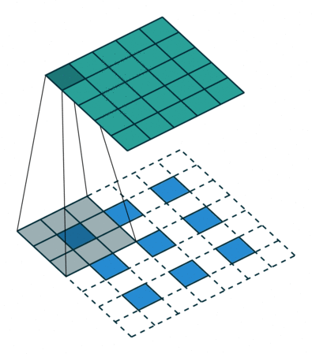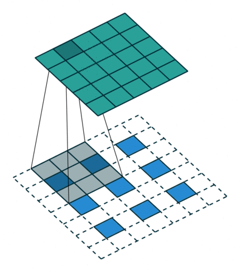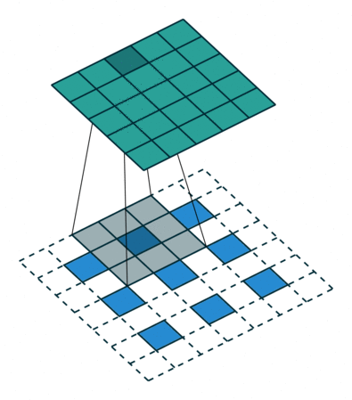

```python
torch.nn.ConvTranspose2d(in_channels=1, out_channels=1, kernel=(3, 3), stride=2, padding=1, dilation=1, bias=False)
```

<!-- *footer: https://github.com/vdumoulin/conv_arithmetic -->

---

#### Deconvolution

Example: Fully Convolutional Networks

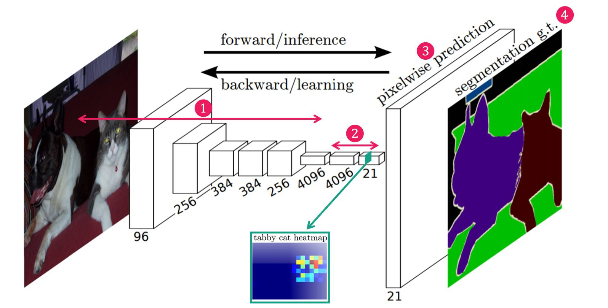

<!-- *footer: Fully Convolutional Networks for Semantic Segmentation (2014) -->

---

#### Dilated convolution

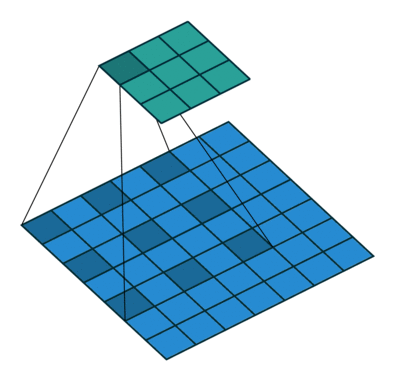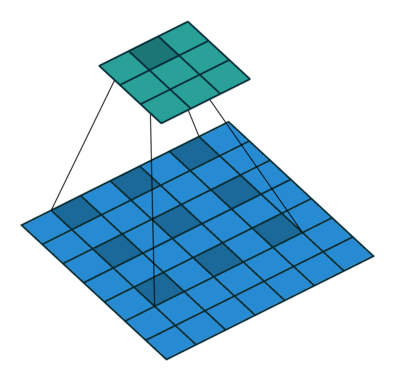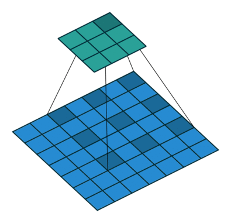

```python
torch.nn.Conv2d(in_channels=1, out_channels=1, kernel=(3, 3), stride=2, padding=1, dilation=2, bias=False)
```

<!-- *footer: https://github.com/vdumoulin/conv_arithmetic -->

---

#### Dilated convolution

Example: DeepLab v2

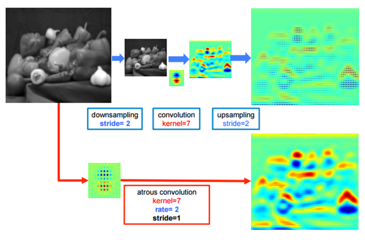

<!-- *footer: DeepLab: Semantic Image Segmentation with Deep Convolutional Nets, Atrous Convolution, and Fully Connected CRFs (2016) -->

---

#### Separable convolution

* = Depthwise convolution + Pointwise convolution

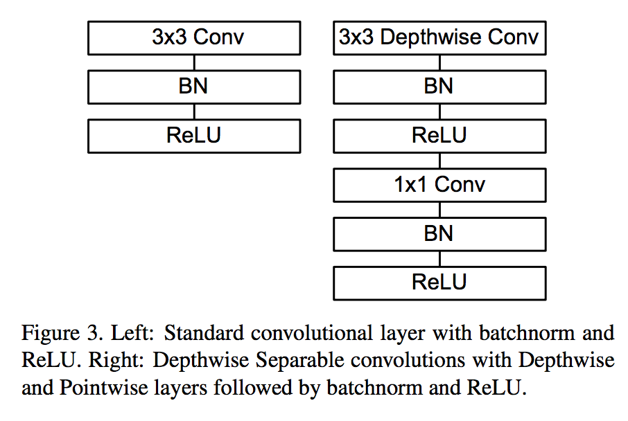

<!-- *footer: MobileNets: Efficient Convolutional Neural Networks for Mobile Vision Applications -->

---

#### Separable convolution

A regular convolution

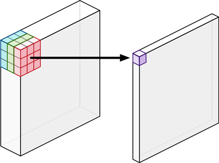

```python
regular = torch.nn.Conv2d(in_channels=in_channels, out_channels=out_channels, kernel_size=3, padding=1)
```

<!-- *footer: http://machinethink.net/blog/googles-mobile-net-architecture-on-iphone/ -->

---

#### Separable convolution

Depthwise convolution

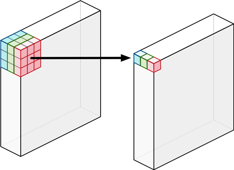

```python
depthwise = torch.nn.Conv2d(in_channels=in_channels, out_channels=in_channels, kernel_size=3, padding=1, groups=in_channels)
```

<!-- *footer: http://machinethink.net/blog/googles-mobile-net-architecture-on-iphone/ -->

---

#### Separable convolution

Pointwise convolution

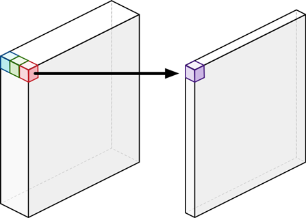


```python
pointwise = torch.nn.Conv2d(in_channels=in_channels, out_channels=out_channels, kernel_size=1)
```

<!-- *footer: http://machinethink.net/blog/googles-mobile-net-architecture-on-iphone/ -->

---

```python
class DepthwiseSeparableConv2d(nn.Module):
    def __init__(self, in_channels, out_channels):
        super(self, DepthwiseSeparableConv2d).__init__()

        depthwise = torch.nn.Conv2d(in_channels=in_channels,
                                    out_channels=in_channels,
                                    kernel_size=3,
                                    padding=1,
                                    groups=in_channels)
        pointwise = torch.nn.Conv2d(in_channels=in_channels,
                                    out_channels=out_channels,
                                    kernel_size=1)
                                    
    def forward(self, input):
        output = self.depthwise(input)
        output = self.pointwise(output)

        return output
```

---

<!-- *template: section -->

## Recurrent <br>Neural Networks

* The recurrent layer
* Gradient vanishing and exploding
* Gradient clipping
* Variations: Long Short-Term Memory (LSTM), Gated Recurrent Unit (GRU)

---

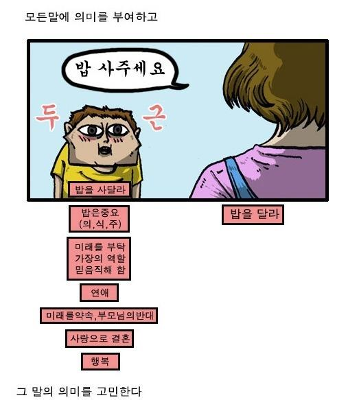

<!-- *footer: 네이버 웹툰 마음의 소리 -->

---

### The recurrent layer

A single RNN cell:


<!-- *footer: http://colah.github.io/posts/2015-08-Understanding-LSTMs/ -->

---

### The recurrent layer

The RNN cell, unrolled:


<!-- *footer: http://colah.github.io/posts/2015-08-Understanding-LSTMs/ -->

---

### The recurrent layer

A simple RNN: $h_t = tanh(w_xx_t + b_x + w_ss_{t-1} + b_t)$


<!-- *footer: http://colah.github.io/posts/2015-08-Understanding-LSTMs/ -->

---

### The recurrent layer

In PyTorch: [`torch.nn.RNN`](https://pytorch.org/docs/stable/nn.html#torch.nn.RNN)

```python
>>> import torch
>>> import torch.nn as nn
>>> rnn = nn.RNN(input_size=10, hidden_size=20, num_layers=2)
>>> input = torch.randn(5, 3, 10)
>>> h0 = torch.randn(2, 3, 20)
>>> output, hn = rnn(input, h0)
```

---

### The recurrent layer

Possibilities:

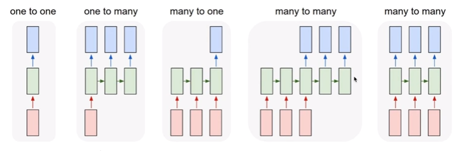

<!-- *footer: CS231n: Lecture 10 -->

---

### The recurrent layer

#### Backpropagation Through Time


---


$$
\frac{\partial{E_t}}{\partial{W}} = \sum_{k=1}^{t}\frac{\partial{E_t}}{\partial{\hat{y}_t}}\frac{\partial{\hat{y}_t}}{\partial{s_t}}\frac{\partial{s_t}}{\partial{s_k}}\frac{\partial{s_k}}{\partial{W}}
$$

---

### The recurrent layer

#### Backpropagation Through Time

In PyTorch:

```python
>>> output, hn = rnn(input, h0)
>>> loss = loss(output, target)
>>> loss.backward()
```

---

### Gradient vanishing and exploding

#### Gradient vanishing

:cold_sweat: Error signals fade before reaching the beginning.

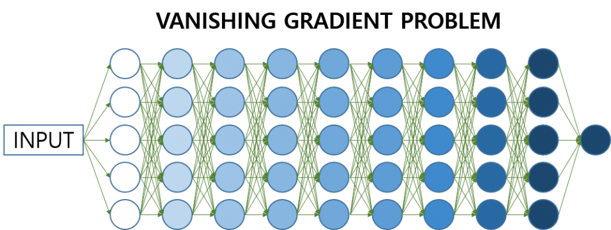

---

### Gradient vanishing and exploding

#### Gradient vanishing

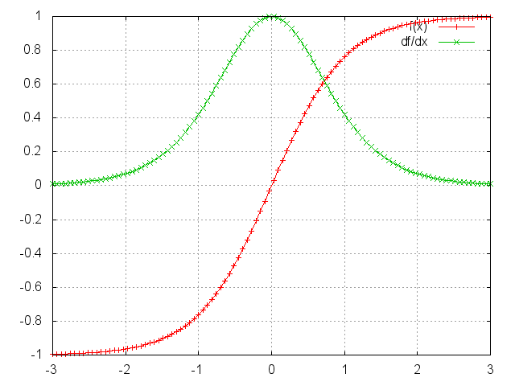

<!-- *footer: http://www.wildml.com/2015/10/recurrent-neural-networks-tutorial-part-3-backpropagation-through-time-and-vanishing-gradients/ -->

---

### Gradient vanishing and exploding

#### Gradient vanishing

:relieved: Let error signals skip layers! (e.g. ResNet, LSTM)

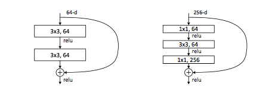

---


---

### Gradient vanishing and exploding

#### Gradient exploding

:cold_sweat: Error signals explode on "gradient cliffs".


<!-- *footer: https://www.quora.com/What-is-gradient-clipping-and-why-is-it-necessary -->

---

### Gradient vanishing and exploding

#### Gradient exploding

:relieved: Set limits on gradients! (e.g. gradient clipping)

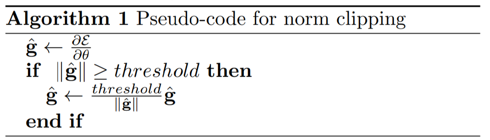

<!-- *footer: On the difficulty of training recurrent neural networks (2012) -->

---

### Variations of RNN

* Long Short-Term Memory (LSTM)
  * Another recurrent path as a highway for gradients
* Gated Recurrent Unit (GRU)
  * Simplification of the LSTM

---

#### Long Short-Term Memory (LSTM)

A simple RNN:


<!-- *footer: http://colah.github.io/posts/2015-08-Understanding-LSTMs/ -->

---

#### Long Short-Term Memory (LSTM)

LSTM:


<!-- *footer: http://colah.github.io/posts/2015-08-Understanding-LSTMs/ -->

---

#### Long Short-Term Memory (LSTM)


<center>Cell state</center>

<!-- *footer: http://colah.github.io/posts/2015-08-Understanding-LSTMs/ -->

---

#### Long Short-Term Memory (LSTM)


<center>Forget gate</center>

<!-- *footer: http://colah.github.io/posts/2015-08-Understanding-LSTMs/ -->

---

#### Long Short-Term Memory (LSTM)


<center>Input gate</center>

<!-- *footer: http://colah.github.io/posts/2015-08-Understanding-LSTMs/ -->

---

#### Long Short-Term Memory (LSTM)


<!-- *footer: http://colah.github.io/posts/2015-08-Understanding-LSTMs/ -->


---

#### Long Short-Term Memory (LSTM)


<!-- *footer: http://colah.github.io/posts/2015-08-Understanding-LSTMs/ -->

---

### Variations of RNN

#### Gated Recurrent Unit (GRU)


<!-- *footer: http://colah.github.io/posts/2015-08-Understanding-LSTMs/ -->

---

<!-- *template: section -->

## Cryptocurrency price prediction

* Cryptocurrency 101
* Obtaining and preprocessing the data
* Building our first CNN model
* Building our first RNN model
* Running live

---

### Cryptocurrency 101

* Cryptocurrency $\neq$ blockchain
  * Cryptocurrency is **an application** of the blockchain
  * Blockchain is a **distributed, peer-to-peer database**
    * Chains blocks together by specially conditioned **hash** values, created by altering the **nonce** value
* Blockchain-based cryptocurrencies
  * Bitcoin, Ethereum, Bitcoin Cash, ...
  * Just like stocks, traded for real currencies at **market exchanges**
  * Just like stocks, each fulfilled orders are called **ticks**

---

### Cryptocurrency 101


---

<!-- *template: center -->

### Obtaining and preprocessing the data

<br>

"There's the joke that 80 percent of data science is cleaning the data and 20 percent is complaining about cleaning the data."

<br>

\- Anthony Goldbloom, Kaggle founder and CEO

---

### Obtaining and preprocessing the data

#### [`data.py`](https://github.com/juneoh/cryptocurrency_price_prediction/blob/master/data.py)

1. Download tick data from coinmarketcap.com
2. Create a Pandas `DataFrame` from the data
2. Create target values `rise` (whether the price rises in the next tick)
3. Normalize price values
4. Define a custom dataset class for `torch.nn.utils.DataLoader`

---

### Obtaining and preprocessing the data

#### Pandas

* Python Data Analysis Library
* Provides **`DataFrame`** objects for fast and efficient data manipulation 
* https://pandas.pydata.org/

---

### Obtaining and preprocessing the data

#### Pandas

Reading CSV as a `DataFrame`

```python
>>> import pandas as pd
>>> df = pd.read_csv('tick.csv')
>>> df.head()
         time    price    amount
0  1535291170  6701.00  1.010000
1  1535291193  6700.55  0.001095
2  1535291212  6691.07  0.084010
3  1535291215  6695.81  0.440000
4  1535291267  6700.81  0.037278
```

---

### Obtaining and preprocessing the data

#### Pandas

Selecting by column

```python
>>> df.price.head()
0    6701.00
1    6700.55
2    6691.07
3    6695.81
4    6700.81
Name: price, dtype: float64
```

---

### Obtaining and preprocessing the data

#### Pandas

Selecting by row

```python
>>> df.ix[0]
time      1.535291e+09
price     6.701000e+03
amount    1.010000e+00
Name: 0, dtype: float64
```

<!-- *footer: More tips on https://juneoh.com/Pandas -->

---

### Building our first CNN model

#### [`cnn.py`](https://github.com/juneoh/cryptocurrency_price_prediction/blob/master/cnn.py)

* [`torch.nn.Conv1d`](https://pytorch.org/docs/stable/nn.html#torch.nn.Conv1d) as the core logic
* [`torch.nn.LeakyReLU`](https://pytorch.org/docs/stable/nn.html#torch.nn.LeakyReLU) as layer activations
* [`torch.nn.Linear`](https://pytorch.org/docs/stable/nn.html#torch.nn.Linear) for the final output
* [`torch.nn.BCEWithLogitLoss`](https://pytorch.org/docs/stable/nn.html#torch.nn.BCEWithLogitsLoss) as the loss function
* [`torch.optim.Adam`](https://pytorch.org/docs/stable/optim.html#torch.optim.Adam) as the optimizer
* [`torch.optim.lr_scheduler,StepLR`](https://pytorch.org/docs/stable/optim.html#torch.optim.lr_scheduler.StepLR) as the learning rate strategy
* [`torch.nn.Sigmoid`](https://pytorch.org/docs/stable/nn.html#torch.nn.Sigmoid) as the final activation

---

### Building our first CNN model

<br>


<!-- *footer: https://www.datasciencecentral.com/m/blogpost?id=6448529%3ABlogPost%3A408853 -->

---

### Building our first CNN model

#### [`rnn.py`](https://github.com/juneoh/cryptocurrency_price_prediction/blob/master/rnn.py)

* [`torch.nn.LSTM`](https://pytorch.org/docs/stable/nn.html#torch.nn.LSTM) as the core logic
* [`torch.nn.BCEWithLogitLoss`](https://pytorch.org/docs/stable/nn.html#torch.nn.BCEWithLogitsLoss) as the loss function
* [`torch.optim.Adam`](https://pytorch.org/docs/stable/optim.html#torch.optim.Adam) as the optimizer
* [`torch.optim.lr_scheduler,StepLR`](https://pytorch.org/docs/stable/optim.html#torch.optim.lr_scheduler.StepLR) as the learning rate strategy
* [`torch.nn.Sigmoid`](https://pytorch.org/docs/stable/nn.html#torch.nn.Sigmoid) as the final activation

---

### Train and test

#### [`train.py`](https://github.com/juneoh/cryptocurrency_price_prediction/blob/master/train.py)

* `--type`: The type of the model, either `rnn` or `cnn`.
* `--num_layers`: The number of layers for the model.
* `--hidden_size`: The size of the hidden state.
* `--sequence_length`: The number of previous ticks per each sample.

```bash
$ python run.py --type rnn ticks.csv
$ python run.py --type cnn ticks.csv
```


---

<!-- *template: center -->

## Thank you!
